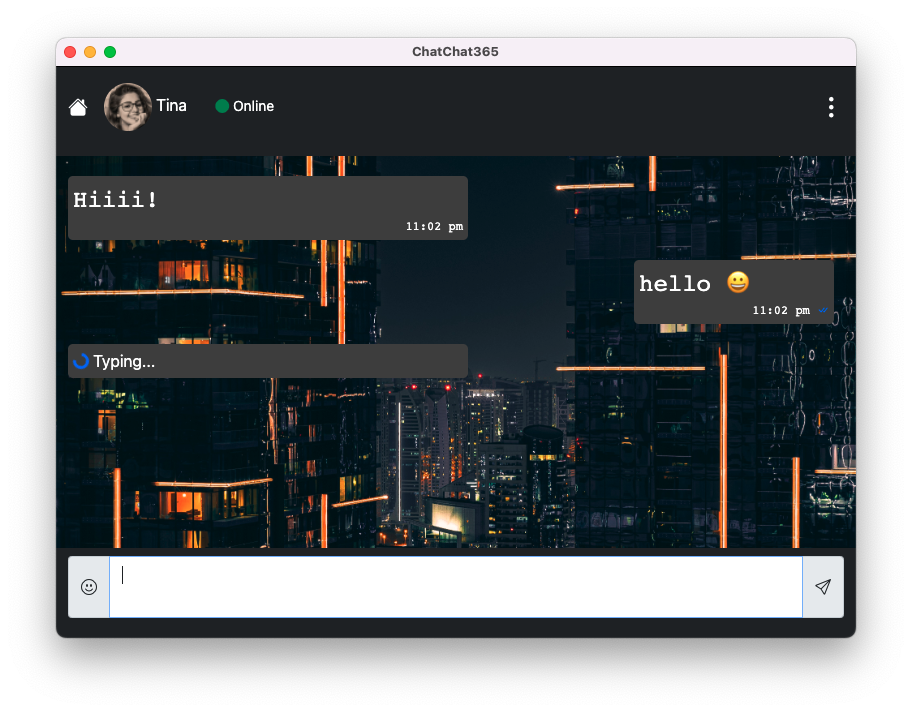

# chatchat365
This is a mock desktop chat app.



## Getting started

This project uses Electron, Node and other cool stuff.

Run the following commands to get started.

1. Clone the project

```shell
git clone https://github.com/yusufshakeel/chatchat365.git
```

2. Change directory

```shell
cd chatchat365
```

3. Install packages

```shell
npm i
```

4. Run mock chat

```shell
npm run watch
```

The app will open and then you can click on the New message notification and it will start displaying
the messages.

## License

It's free :smiley:

[MIT License](https://github.com/yusufshakeel/chatchat365/blob/main/LICENSE) Copyright (c) 2022 Yusuf Shakeel

### Donate

Feeling generous :smiley: [Donate via PayPal](https://www.paypal.me/yusufshakeel)
